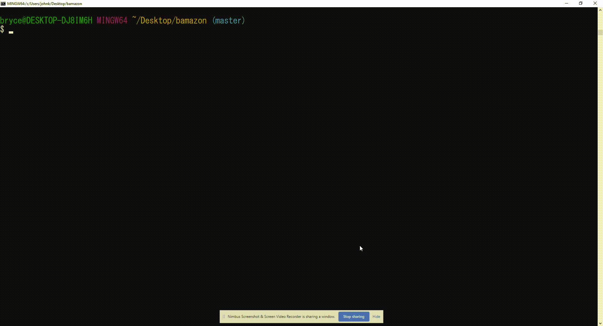

# bamazon

###  bamazon is a server application created using node.js and interacts with a MySQL database. 

# Customer Application

### The customer application allows users to view products for sale, select a product by ID, and select a quantity to purchase. Once a product and a quantity is selected the product stock quantity will be updated in the MySQL database. 

# Manager Application

### The manager application allows users to view products for sale, view low inventory, add to inventory, and add a new product.

## View Products

___

## View Low Inventory

___

## Add To Inventory

___

## Add New Product

___

